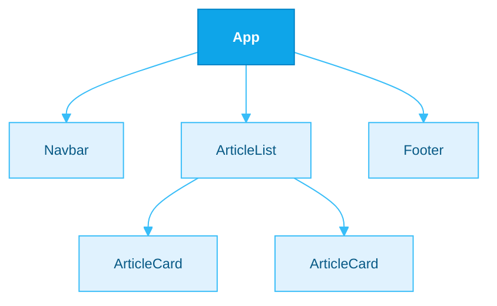
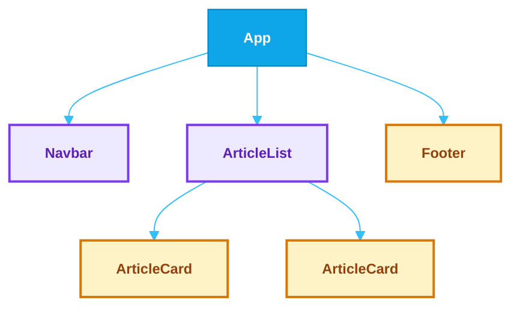
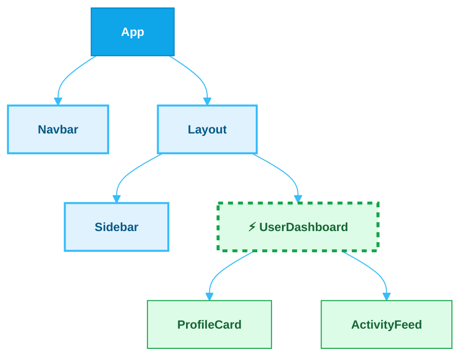
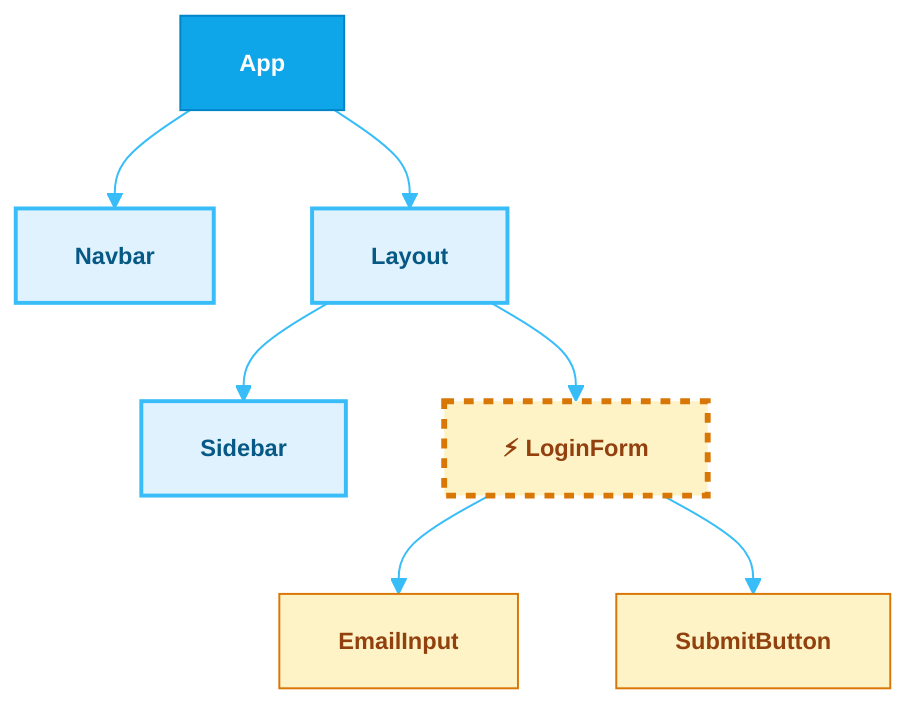

## Props & Rendering

Props și randarea componentelor

<div class="absolute top-2 right-2 w-8 h-8">
<GithubLink repo="https://github.com/cristi-usm/react-course" />
</div>

---
layout: top-title
align: c
color: sky-light
---

:: title ::
# Problema Div-urilor Inutile 

:: content ::

JSX cere un **singur element rădăcină**. Soluția instinctivă este să înfășori totul într-un `<div>` — dar asta poate strica layout-ul și poluează DOM-ul.

<div class="flex items-center justify-center gap-6 mt-4">

<div class="bg-orange-50 border-4 border-orange-400 rounded-2xl p-4 flex-1 max-w-lg">
<h4 class="text-xs font-black mb-3 text-center">Prea multe div-uri inutile</h4>

```jsx
function UserCard() {
  return (
    <div> {/* div inutil! */}
      <dt>Nume</dt>
      <dd>Ion Popescu</dd>
    </div>
  );
}
function ProfilePage() {
  return <dl><UserCard /><UserCard /></dl>;
}
```

</div>

<div  class="bg-red-50 border-4 border-red-400 rounded-2xl p-4 flex-1 max-w-sm self-center">
<h4 class="text-xs font-black mb-3 text-center">DOM-ul rezultat</h4>

```html
<dl>
  <div> <!-- ❌ invalid! -->
    <dt>Nume</dt>
    <dd>Ion Popescu</dd>
  </div>
  <div><!-- ❌ invalid! -->...</div>
</dl>
```

<p class="text-xs mt-3 text-red-700 font-semibold">Un <code>&lt;div&gt;</code> direct în <code>&lt;dl&gt;</code> este HTML invalid. Flexbox și Grid se pot strica și ele din cauza wrapper-elor inutile.</p>
</div>

</div>

<div >

<AdmonitionType type="warning" class="mt-4">

Fiecare `<div>` adăugat doar pentru a satisface regula JSX crește inutil adâncimea DOM-ului, poate afecta stilurile CSS și accesibilitatea.

</AdmonitionType>

</div>

---
layout: top-title
align: c
color: sky-light
---

:: title ::
# Soluția - `<Fragment>`

:: content ::

`React.Fragment` este un component special care grupează elemente **fără a adăuga niciun nod în DOM**.

<div class="flex items-center justify-center gap-6 mt-4">

<div class="bg-sky-50 border-4 border-sky-400 rounded-2xl p-4 flex-1 max-w-lg">
<h4 class="text-xs font-black mb-3 text-center">Cu Fragment</h4>

```jsx
import { Fragment } from 'react';

function UserCard() {
  return (
    <Fragment>
      <dt>Nume</dt>
      <dd>Ion Popescu</dd>
    </Fragment>
  );
}
// ProfilePage rămâne identic — doar UserCard se schimbă
```

</div>

<div  class="bg-emerald-50 border-4 border-emerald-400 rounded-2xl p-4 flex-1 max-w-sm self-center">
<h4 class="text-xs font-black mb-3 text-center">DOM-ul rezultat</h4>

```html
<dl>
  <dt>Nume</dt>   <!-- corect! -->
  <dd>Ion Popescu</dd>
  <dt>Nume</dt>
  <dd>Ion Popescu</dd>
</dl>
```

<p class="text-xs mt-3 text-emerald-700 font-semibold">Fragment dispare complet din DOM. Structura HTML este validă, layout-ul rămâne intact.</p>
</div>

</div>

<div >

<AdmonitionType type="tip" class="mt-4">

`Fragment` acceptă și prop-ul `key`, util când randezi liste de fragmente: `<Fragment key={item.id}>`. Acesta este singurul prop acceptat de Fragment.

</AdmonitionType>

</div>

---
layout: top-title
align: c
color: sky-light
---

:: title ::
# Sintaxa Scurtă  `<>...</>`

:: content ::

În practică, aproape întotdeauna vei folosi sintaxa prescurtată `<>` în loc de `<Fragment>` — mai puțin cod, același rezultat.

<div class="flex items-center justify-center gap-6 mt-4">

<div class="bg-purple-50 border-4 border-purple-400 rounded-2xl p-4 flex-1 max-w-md">
<h4 class="text-xs font-black mb-3 text-center"><code>&lt;Fragment&gt;</code> explicit</h4>

```jsx
import { Fragment } from 'react';
function UserCard() {
  return (
    <Fragment>
      <dt>Nume</dt>
      <dd>Ion Popescu</dd>
    </Fragment>
  );
}
```

<p class="text-xs mt-2 text-center text-purple-700">Necesar când ai nevoie de prop-ul <code>key</code></p>
</div>

<div class="text-4xl font-black text-sky-400 self-center">
→
</div>

<div class="bg-sky-50 border-4 border-sky-400 rounded-2xl p-4 flex-1 max-w-md">
<h4 class="text-xs font-black mb-3 text-center">Sintaxă scurtă <code>&lt;&gt;</code></h4>

```jsx
function UserCard() {
  return (
    <>
      <dt>Nume</dt>
      <dd>Ion Popescu</dd>
    </>
  );
}
```

<p class="text-xs mt-2 text-center text-sky-700">Fără import, fără cod suplimentar</p>
</div>

</div>

<div >

<AdmonitionType type="important" class="mt-4">

**Limitare:** `<>` nu acceptă niciun prop, inclusiv `key`. Dacă ai nevoie de `key` (ex: în `.map()`), folosește `<Fragment key={...}>` explicit.

</AdmonitionType>

</div>

---
layout: top-title
align: c
color: sky-light
---

:: title ::
# JavaScript în JSX: Ghilimele și Acolade

:: content ::

JSX are două moduri de a insera valori: **ghilimele** pentru string-uri statice și **acolade** `{}` pentru orice expresie JavaScript.

<div class="flex items-center justify-center gap-4 mt-3">

<div class="bg-orange-50 border-4 border-orange-400 rounded-2xl p-3 flex-1 max-w-sm">
<h4 class="text-xs font-black mb-3 text-center">Ghilimele — string static</h4>

```jsx
// Valoarea e mereu aceeași


<p className="card-title">
  Salut!
</p>
```

<p class="text-xs mt-2 text-orange-800">Folosești <code>"..."</code> sau <code>'...'</code> — valoarea nu poate fi calculată.</p>
</div>

<div  class="bg-sky-50 border-4 border-sky-400 rounded-2xl p-3 flex-1 max-w-sm">
<h4 class="text-xs font-black mb-3 text-center">Acolade — expresie JS</h4>

```jsx
const url = 'https://example.com/img.png';
const label = 'Avatar';


<p className={isActive ? 'active' : ''}>
  {greeting}
</p>
```

<p class="text-xs mt-2 text-sky-800">Folosești <code>{'{}'}</code> — orice expresie JS validă.</p>
</div>

</div>

<div >

<AdmonitionType type="warning" class="mt-4">

`src="{url}"` NU funcționează — JSX va transmite literal string-ul `"{url}"`, nu valoarea variabilei.

</AdmonitionType>

</div>

---
layout: top-title
align: c
color: sky-light
margin: tight
---

:: title ::
# Acolada — O Fereastră în JavaScript

:: content ::

Între `{ }` poți scrie **orice expresie JavaScript** validă: variabile, calcule, apeluri de funcții, operatori ternari.

<div class="grid grid-cols-2 gap-4 mt-4">

<div class="bg-sky-50 border-4 border-sky-400 rounded-2xl p-3">
<h4 class="text-xs font-black mb-3 text-center">Variabile și calcule</h4>

```jsx
const name = 'Ana';
const items = [1, 2, 3];

<h1>Salut, {name}!</h1>
<p>Ai {items.length} notificări.</p>
<p>Total: {10 * 4.5} lei</p>
```

</div>

<div  class="bg-sky-50 border-4 border-sky-400 rounded-2xl p-3">
<h4 class="text-xs font-black mb-3 text-center">Apeluri de funcții</h4>

```jsx
function formatDate(date) {
  return new Intl.DateTimeFormat('ro').format(date);
}

<p>Azi: {formatDate(new Date())}</p>
<p>{name.toUpperCase()}</p>
```

</div>

<div  class="bg-sky-50 border-4 border-sky-400 rounded-2xl p-3">
<h4 class="text-xs font-black mb-3 text-center">Operatori ternari</h4>

```jsx
const isLoggedIn = true;

<h2>{isLoggedIn ? 'Bun venit!' : 'Autentifică-te'}</h2>
<span>{count === 1 ? '1 mesaj' : `${count} mesaje`}</span>
```

</div>

<div  class="bg-amber-50 border-4 border-amber-400 rounded-2xl p-3">
<h4 class="text-xs font-black mb-3 text-center">Ce NU merge în acolade</h4>

```jsx
// ❌ instrucțiuni JS (if, for, while...)
{ if (ok) { ... } }

// ❌ declarații de variabile
{ const x = 5 }

// ✅ doar expresii care returnează o valoare
{ ok ? 'da' : 'nu' }
```

</div>

</div>

---
layout: top-title
align: c
color: sky-light
---

:: title ::
# Acolade Duble `{{` `}}` — Obiecte în JSX

:: content ::

`{{` `}}` nu este sintaxă specială JSX. Este un **obiect JavaScript** `{ }` înăuntrul acoladei JSX `{ }`.

<div class="flex items-center justify-center gap-4 mt-3">

<div class="bg-sky-50 border-4 border-sky-400 rounded-2xl p-3 flex-1 max-w-md">
<h4 class="text-xs font-black mb-3 text-center">Stiluri inline cu <code>style</code></h4>

```jsx
<p style={{ color: 'crimson', fontSize: 18 }}>
  Text roșu
</p>

// Echivalent — obiect extras:
const myStyle = {
  color: 'crimson',
  fontSize: 18,
};
<p style={myStyle}>Text roșu</p>
```

<p class="text-xs mt-2 text-sky-800">Proprietățile CSS devin camelCase: <code>font-size</code> → <code>fontSize</code>, <code>background-color</code> → <code>backgroundColor</code>.</p>
</div>

<div  class="bg-purple-50 border-4 border-purple-400 rounded-2xl p-3 flex-1 max-w-md">
<h4 class="text-xs font-black mb-3 text-center">Alte obiecte ca props</h4>

```jsx
const theme = {
  primary: '#0ea5e9',
  secondary: '#6366f1',
};

<Chart
  colors={theme}
  padding={{ top: 16, left: 8 }}
  grid={{ show: true, lines: 5 }}
/>
```

<p class="text-xs mt-2 text-purple-800">Orice prop poate primi un obiect — nu doar <code>style</code>.</p>
</div>

</div>

<div >

<AdmonitionType type="tip" class="mt-4">

**Regulă de reținut:** `{` deschide fereastra JS, `{` al doilea începe obiectul. `}` primul închide obiectul, `}` al doilea închide fereastra JSX.

</AdmonitionType>

</div>

---
layout: top-title
align: c
color: sky-light
---

:: title ::
# Ce sunt Props?

:: content ::

**Props** (prescurtare de la *properties*) sunt datele pe care un component părinte le trimite unui component copil. Funcționează exact ca **argumentele unei funcții**.

<div class="flex items-center justify-center gap-6 mt-4">

<div class="bg-orange-50 border-4 border-orange-400 rounded-2xl p-4 flex-1 max-w-sm">
<h4 class="text-xs font-black mb-3 text-center">Funcție JavaScript</h4>

```js
function greet(name, age) {
  return `Salut ${name}, ai ${age} ani!`;
}

greet('Ana', 22);
```

<p class="text-xs mt-2 text-orange-800">Transmiți argumente la apelul funcției.</p>
</div>

<div class="text-3xl font-black text-sky-400 self-center">≈</div>

<div  class="bg-sky-50 border-4 border-sky-400 rounded-2xl p-4 flex-1 max-w-sm">
<h4 class="text-xs font-black mb-3 text-center">Componentă React</h4>

```jsx
function Greet(props) {
  return (
    <p>Salut {props.name}, ai {props.age} ani!</p>
  );
}

<Greet name="Ana" age={22} />
```

<p class="text-xs mt-2 text-sky-800">Transmiți props ca atribute JSX.</p>
</div>

</div>

<div >

<AdmonitionType type="important" class="mt-4">

Props sunt **read-only** — un component nu-și poate modifica propriile props. Datele curg **într-un singur sens**: de la părinte la copil.

</AdmonitionType>

</div>

---
layout: top-title
align: c
color: sky-light
---

:: title ::
# Cum se Transmit și se Folosesc Props

:: content ::

<div class="flex items-center justify-center gap-6 mt-4">

<div class="bg-purple-50 border-4 border-purple-400 rounded-2xl p-4 flex-1">
<h4 class="text-xs font-black mb-3 text-center">Părintele — trimite props</h4>

```jsx
function App() {
  return (
    <div>
      <Avatar
        person={{ name: 'Ana Pop', id: 'ana' }}
        size={80}
        isAdmin={true}
      />
      <Avatar
        person={{ name: 'Ion Radu', id: 'ion' }}
        size={40}
        isAdmin={false}
      />
    </div>
  );
}
```

<p class="text-xs mt-2 text-purple-800">Strings cu ghilimele, orice altceva în acolade.</p>
</div>

<div  class="bg-sky-50 border-4 border-sky-400 rounded-2xl p-4 flex-1">
<h4 class="text-xs font-black mb-3 text-center">Copilul — primește props</h4>

```jsx
function Avatar(props) {
  return (
    <div style={{ width: props.size }}>
      
      {props.isAdmin && <span>Admin</span>}
    </div>
  );
}
```

<p class="text-xs mt-2 text-sky-800">Copilul primește un singur obiect <code>props</code>.</p>
</div>

</div>

---
layout: top-title
align: c
color: sky-light
margin: tight
---

:: title ::
# Destructurarea Props și Valori Implicite

:: content ::

În loc de `props.x`, poți **destructura** props direct în parametrii funcției — mai puțin cod, mai ușor de citit.

<div class="flex items-center justify-center gap-6 mt-3">

<div class="bg-orange-50 border-4 border-orange-400 rounded-2xl p-4 flex-1">
<h4 class="text-xs font-black mb-3 text-center">Fără destructurare</h4>

```jsx
function Avatar(props) {
  return (
    
  );
}
```

</div>

<div  class="bg-sky-50 border-4 border-sky-400 rounded-2xl p-4 flex-1">
<h4 class="text-xs font-black mb-3 text-center">Cu destructurare + valori implicite</h4>

```jsx
function Avatar({ src, alt, size = 48 }) {
  return (
    
  );
}

<Avatar src="..." alt="Ana" /> // size = 48
<Avatar src="..." alt="Ion" size={100} /> // size = 100
```

</div>

</div>

<div >

<AdmonitionType type="tip" class="mt-3">

Valoarea implicită se aplică **doar** când prop-ul lipsește sau este `undefined`. Dacă transmiți explicit `null`, valoarea implicită **nu** se aplică.

</AdmonitionType>

</div>

---
layout: top-title
align: c
color: sky-light
---

:: title ::
# Transmiterea props-urilor mai departe

:: content ::

Când un component intermediar trebuie să transmită toate props-urile mai departe, poți folosi **spread** `{...props}` în loc să le specifici manual pe toate.

<div class="flex items-center justify-center gap-4 mt-3">

<div class="bg-orange-50 border-4 border-orange-400 rounded-2xl p-3 flex-1">
<h4 class="text-xs font-black mb-2 text-center">Fără spread</h4>

```jsx
function FancyButton({ onClick, disabled, children }) {
  return (
    <button className="fancy"
      onClick={onClick} disabled={disabled}>
      {children}
    </button>
  );
}
```

<p class="text-xs mt-2 text-orange-800">Fiecare prop trebuie specificat manual.</p>
</div>

<div  class="bg-sky-50 border-4 border-sky-400 rounded-2xl p-3 flex-1">
<h4 class="text-xs font-black mb-2 text-center">Cu spread — concis</h4>

```jsx
function FancyButton({ variant = 'primary', ...rest }) {
  return (
    <button
      className={`fancy fancy--${variant}`}
      {...rest}
    />
  );
}
<FancyButton variant="danger" onClick={fn} disabled>
  Șterge
</FancyButton>
```

<p class="text-xs mt-2 text-sky-800"><code>...rest</code> colectează tot ce nu e destructurat explicit.</p>
</div>

</div>

<div >

<AdmonitionType type="warning" class="mt-4">

Nu folosi `{...props}` pe orice componentă — transmite doar ce e nevoie. Spread-ul excesiv face codul greu de urmărit și poate duce la props neașteptate pe elemente HTML native.

</AdmonitionType>

</div>

---
layout: top-title
align: c
color: sky-light
---

:: title ::
# JSX ca Prop

:: content ::

Orice prop poate primi **JSX** ca valoare — nu doar string-uri sau numere. Componenta primitor nu știe (și nu trebuie să știe) ce conține prop-ul, îl randează pur și simplu.

<div class="border-4 border-sky-300 rounded-2xl overflow-hidden mt-4">
<JsxPropDemo />
</div>

---
layout: top-title
align: c
color: sky-light
---

:: title ::
# Prop-ul `children`

:: content ::

Când scrii conținut **între tag-urile** unei componente, React îl colectează automat în prop-ul special `children` — cel mai natural mod de a compune componente.

<div class="border-4 border-purple-300 rounded-2xl overflow-hidden mt-4">
<ChildrenDemo />
</div>

---
layout: top-title
align: c
color: sky-light
margin: tight
---

:: title ::
# Randare Condiționată

:: content ::

Componentele pot afișa **conținut diferit** în funcție de condiții. React folosește JavaScript pur — nu există directive speciale.

<div class="flex items-center justify-center gap-6 mt-3">

<div class="bg-orange-50 border-4 border-orange-400 rounded-2xl p-3 flex-1 max-w-xs">
<h4 class="text-xs font-black mb-3 text-center">Fără condiție</h4>

```jsx
function Item({ name }) {
  return <li>{name}</li>;
}
```

<p class="text-xs mt-2 text-orange-800">Mereu același rezultat, indiferent de context.</p>
</div>

<div  class="bg-sky-50 border-4 border-sky-400 rounded-2xl p-3 flex-1 max-w-xs">
<h4 class="text-xs font-black mb-3 text-center">Cu condiție</h4>

```jsx
function Item({ name, isPacked }) {
  if (isPacked) {
    return <li>{name} ✅</li>;
  }
  return <li>{name}</li>;
}
```

<p class="text-xs mt-2 text-sky-800">Randezi JSX diferit pe baza unui prop.</p>
</div>

</div>

<div >

<AdmonitionType type="info" class="mt-3">

React folosește **JavaScript pur** pentru randarea condiționată — `if`, `&&`, `? :`. Nu există directive speciale (cum ar fi `v-if` în Vue).

</AdmonitionType>

</div>

---
layout: top-title
align: c
color: sky-light
margin: tight
---

:: title ::
# `if` și `else` — Ramuri Diferite

:: content ::

Cel mai explicit mod: returnezi **JSX complet diferit** pentru fiecare ramură — fiecare `return` este o cale separată.

<div class="flex flex-col gap-3 mt-3">

<div class="bg-sky-50 border-4 border-sky-400 rounded-2xl p-3">
<h4 class="text-xs font-black mb-2 text-center">

Un singur `if` — mai multe puncte de `return`

</h4>

```jsx
function StatusBadge({ isActive }) {
  if (isActive) return <span className="badge-green">Activ</span>;
  return <span className="badge-gray">Inactiv</span>;
}
```

</div>

<div  class="bg-purple-50 border-4 border-purple-400 rounded-2xl p-3">

```jsx
function TrafficLight({ color }) {
  if (color === 'red')    return <p>Oprire!</p>;
  if (color === 'yellow') return <p>Pregătire...</p>;
  return <p>Mergi!</p>;
}
```

</div>

</div>

---
layout: top-title
align: c
color: sky-light
margin: tight
---

:: title ::
# Returnarea `null` — Nu Randa Nimic

:: content ::

Un component poate returna `null` pentru a nu randa **absolut nimic**. Util când vrei să ascunzi complet un element.

<div class="flex items-center justify-center gap-6 mt-3">

<div class="bg-sky-50 border-4 border-sky-400 rounded-2xl p-3 flex-1">
<h4 class="text-xs font-black mb-3 text-center">

Returnează `null`

</h4>

```jsx
function WarningBanner({ show, message }) {
  if (!show) return null;
  return (
    <div className="warning">
      {message}
    </div>
  );
}
```

<p class="text-xs mt-2 text-sky-800">Componentul nu lasă niciun nod în DOM — nici măcar un comentariu.</p>
</div>

<div  class="bg-amber-50 border-4 border-amber-400 rounded-2xl p-3 flex-1">
<h4 class="text-xs font-black mb-3 text-center">Alternativa — din părinte</h4>

```jsx
function App() {
  return (
    <div>
      {hasWarning && (
        <WarningBanner message="Eroare!" />
      )}
      <Content />
    </div>
  );
}
```

<p class="text-xs mt-2 text-amber-800">De preferat: controlul vizibilității din <strong>componenta părinte</strong> este mai explicit decât <code>null</code> din interior.</p>
</div>

</div>

---
layout: top-title
align: c
color: sky-light
margin: tight
---

:: title ::
# Operatorul Ternar `? :`

:: content ::

Alternativa compactă pentru `if/else` **în interiorul JSX-ului** — randează una din două expresii.

<div class="flex items-center justify-center gap-6 mt-3">

<div class="bg-sky-50 border-4 border-sky-400 rounded-2xl p-3 flex-1">
<h4 class="text-xs font-black mb-3 text-center">Text diferit</h4>

```jsx
function Item({ name, isPacked }) {
  return (
    <li>
      {isPacked ? name + ' ✅' : name}
    </li>
  );
}
```

<p class="text-xs mt-2 text-sky-800"><code>condiție ? valoare_true : valoare_false</code></p>
</div>

<div  class="bg-purple-50 border-4 border-purple-400 rounded-2xl p-3 flex-1">
<h4 class="text-xs font-black mb-3 text-center">JSX sau clase diferite</h4>

```jsx
function StatusBadge({ isActive }) {
  return (
    <span className={isActive ? 'badge-green' : 'badge-gray'}>
      {isActive ? 'Activ' : 'Inactiv'}
    </span>
  );
}
```

<p class="text-xs mt-2 text-purple-800">Funcționează și pentru <code>className</code>, <code>style</code>, orice prop.</p>
</div>

</div>

<div >

<AdmonitionType type="tip" class="mt-3">

Pentru condiții cu **două variante** ternarul este perfect. Dacă ai mai mult de două ramuri sau JSX complex — folosește `if/else` separat, e mai lizibil.

</AdmonitionType>

</div>

---
layout: top-title
align: c
color: sky-light
margin: tight
---

:: title ::
# Short-Circuit — Cum funcționează `&&`

:: content ::

`A && B` nu returnează `true`/`false` — returnează **una din cele două valori**. React randează ce primește.

<div class="flex items-center justify-center gap-4 mt-3">

<div class="bg-sky-50 border-4 border-sky-400 rounded-2xl p-3 flex-1">
<h4 class="text-xs font-black mb-2 text-center">Regula de evaluare</h4>

```js
// Dacă A este falsy → returnează A (B nu se evaluează)
false  && <X />   // → false   (nimic)
null   && <X />   // → null    (nimic)
undefined && <X />//→ undefined(nimic)

// Dacă A este truthy → returnează B
true   && <X />   // → <X />   (randat)
"text" && <X />   // → <X />   (randat)
```

</div>

<div  class="bg-red-50 border-4 border-red-400 rounded-2xl p-3 flex-1">
<h4 class="text-xs font-black mb-2 text-center">

De ce `0` e special

</h4>

```js
// 0 este FALSY — returnează 0, nu false
// React randează 0 ca nod text!
0 && <X />   // → 0   ← apare "0" în pagină!

// null/false sunt ignorate de React
// 0 nu este ignorat!
false && <X />  // → nimic ✅
0     && <X />  // → "0"   ❌
```

<p class="text-xs mt-2 text-red-800">React ignoră <code>false</code>, <code>null</code>, <code>undefined</code> — dar <strong>nu</strong> <code>0</code>.</p>
</div>

</div>

---
layout: top-title
align: c
color: sky-light
margin: tight
---

:: title ::
# Operatorul `&&` — Afișează sau Nimic

:: content ::

`&&` randează ceva **dacă condiția e adevărată**, altfel nu randează nimic. Echivalentul ternarului cu `null` pe ramura falsă.

<div class="flex items-center justify-center gap-4 mt-3">

<div class="bg-sky-50 border-4 border-sky-400 rounded-2xl p-3 flex-1">
<h4 class="text-xs font-black mb-2 text-center">Exemplu de bază</h4>

```jsx
function Item({ name, isPacked }) {
  return <li>{name} {isPacked && '✅'}</li>;
}
// isPacked=true  → "React ✅"
// isPacked=false → "React"
```

</div>

<div  class="bg-red-50 border-4 border-red-400 rounded-2xl p-3 flex-1">
<h4 class="text-xs font-black mb-2 text-center">

Capcana cu `0`
</h4>

```jsx
// ❌ Randează "0" în DOM!
{messages.length && <Inbox />}

// ✅ Boolean explicit
{messages.length > 0 && <Inbox />}
```

<p class="text-xs mt-2 text-red-800">Stânga lui <code>&&</code> trebuie să fie boolean, nu număr.</p>
</div>

</div>

<div >

<AdmonitionType type="tip" class="mt-3">

Folosit frecvent pentru: badge-uri condiționate, bannere de eroare, panouri admin — oriunde vrei **„afișează sau nimic"** fără o ramură `else`.

</AdmonitionType>

</div>

---
layout: top-title
align: c
color: sky-light
---

:: title ::
# Demo — Randare Condiționată

:: content ::

`if/else`, `? :` și `&&` combinate într-un singur exemplu. Modifică props-urile direct în editor!

<div class="border-4 border-sky-300 rounded-2xl overflow-hidden mt-4">
<ConditionalDemo />
</div>

---
layout: top-title
align: c
color: sky-light
margin: tight
---

:: title ::
# Randarea Listelor cu `map()`

:: content ::

Pentru a randa o **colecție de date** ca JSX, folosești `map()` — transformi fiecare element al array-ului într-un element JSX.

<div class="flex items-center justify-center gap-4 mt-3">

<div class="bg-sky-50 border-4 border-sky-400 rounded-2xl p-3 flex-1">
<h4 class="text-xs font-black mb-2 text-center">Array de string-uri</h4>

```jsx
const cursuri = ['React', 'Vue', 'Angular'];

export default function App() {
  return (
    <ul>
      {cursuri.map(curs => (
        <li>{curs}</li>
      ))}
    </ul>
  );
}
```

</div>

<div  class="bg-purple-50 border-4 border-purple-400 rounded-2xl p-3 flex-1">
<h4 class="text-xs font-black mb-2 text-center">Array de obiecte</h4>

```jsx
const cursuri = [
  { id: 1, nume: 'React', nivel: 'Începător' },
  { id: 2, nume: 'Vue',   nivel: 'Mediu' },
];

return (
  <ul>
    {cursuri.map(curs => (
      <li key={curs.id}>
        <b>{curs.nume}</b> — {curs.nivel}
      </li>
    ))}
  </ul>
);
```

</div>

</div>

<div >

<AdmonitionType type="info" class="mt-3">

`map()` returnează un **array de elemente JSX** — React știe să randeze array-urile direct în JSX, fără nicio sintaxă specială.

</AdmonitionType>

</div>

---
layout: top-title
align: c
color: sky-light
margin: tight
---

:: title ::
# Filtrare cu `filter()` + `map()`

:: content ::

Combini `filter()` pentru a selecta elementele dorite, apoi `map()` pentru a le transforma în JSX — un **pipeline** de transformare.

<div class="flex items-center justify-center gap-4 mt-3">

<div class="bg-sky-50 border-4 border-sky-400 rounded-2xl p-3 flex-1">
<h4 class="text-xs font-black mb-2 text-center">Doi pași separați</h4>

```jsx
const chimisti = persoane.filter(
  p => p.profesie === 'chimist'
);

return (
  <ul>
    {chimisti.map(p => (
      <li key={p.id}>{p.nume}</li>
    ))}
  </ul>
);
```

</div>

<div  class="bg-emerald-50 border-4 border-emerald-400 rounded-2xl p-3 flex-1">
<h4 class="text-xs font-black mb-2 text-center">Inline — chaining</h4>

```jsx
return (
  <ul>
    {persoane
      .filter(p => p.profesie === 'chimist')
      .map(p => (
        <li key={p.id}>{p.nume}</li>
      ))
    }
  </ul>
);
```

</div>

</div>

---
layout: top-title
align: c
color: sky-light
margin: tight
---

:: title ::

# Prop-ul `key` — De ce îl cere React

:: content ::

Fiecare element dintr-un `map()` trebuie să aibă un prop `key` unic. React îl folosește pentru a identifica ce s-a schimbat.

<div class="flex items-center justify-center gap-4 mt-3">

<div class="bg-orange-50 border-4 border-orange-400 rounded-2xl p-3 flex-1">
<h4 class="text-xs font-black mb-2 text-center">

Fără `key`

</h4>

```jsx
// ⚠️ Warning: Each child in a list
//    should have a unique "key" prop.
{items.map(item => (
  <li>{item.name}</li>
))}
```

<p class="text-xs mt-2 text-orange-800">React nu poate urmări identitatea elementelor — poate pierde starea sau randa greșit la modificări.</p>
</div>

<div  class="bg-sky-50 border-4 border-sky-400 rounded-2xl p-3 flex-1">
<h4 class="text-xs font-black mb-2 text-center">

Cu `key` — corect

</h4>

```jsx
{items.map(item => (
  <li key={item.id}>{item.name}</li>
))}
```

<p class="text-xs mt-2 text-sky-800"><code>key</code> ajută React să știe care element e care, chiar dacă ordinea se schimbă.</p>
</div>

</div>

<div >

<AdmonitionType type="important" class="mt-3">

`key` **nu este transmis ca prop** în componentă — nu poți accesa `props.key`. Dacă ai nevoie de valoarea lui, transmite-o și ca alt prop: `<Profile key={id} userId={id} />`.

</AdmonitionType>

</div>

---
layout: top-title
align: c
color: sky-light
margin: tight
---

:: title ::
# Reguli pentru `key`

:: content ::

<div class="grid grid-cols-2 gap-3 mt-3">

<div class="bg-sky-50 border-4 border-sky-400 rounded-2xl p-3">
<h4 class="text-xs font-black mb-2 text-center">De unde luăm key-uri</h4>

```jsx
// ✅ ID din baza de date (cel mai sigur)
<li key={item.id}>{item.name}</li>

// ✅ UUID generat la crearea datelor
const item = { id: crypto.randomUUID(), ... };

// ✅ Contor incrementat, stabil în timp
```

</div>

<div  class="bg-red-50 border-4 border-red-400 rounded-2xl p-3">
<h4 class="text-xs font-black mb-2 text-center">Ce să eviți</h4>

```jsx
// ❌ Math.random() — key nou la fiecare render!
<li key={Math.random()}>{item.name}</li>

// ❌ Index — probleme la reordonare/ștergere
{items.map((item, index) => (
  <li key={index}>{item.name}</li>
))}
```

<p class="text-xs mt-2 text-red-800">Index-ul e ok doar pentru liste <strong>statice</strong>, fără reordonare sau ștergere.</p>
</div>

</div>

<div >

<AdmonitionType type="tip" class="mt-3">

Pentru elemente multiple per item, folosește `<Fragment key={p.id}>` explicit — sintaxa scurtă `<>` nu acceptă prop-ul `key`.

</AdmonitionType>

</div>

---
layout: top-title
align: c
color: sky-light
margin: tight
---

:: title ::
# Componente Pure

:: content ::

O componentă pură respectă două reguli: **nu modifică nimic din exterior** și returnează **același JSX pentru aceleași props**.

<div class="flex items-center justify-center gap-3 mt-3 text-center">
  <div class="bg-sky-100 border-2 border-sky-400 rounded-xl px-4 py-3 text-sm font-semibold text-sky-800">props</div>
  <div class="text-2xl text-sky-400 font-black">→</div>
  <div class="bg-sky-50 border-4 border-sky-400 rounded-xl px-4 py-3 text-sm font-bold text-sky-900">Componentă</div>
  <div class="text-2xl text-sky-400 font-black">→</div>
  <div class="bg-emerald-100 border-2 border-emerald-400 rounded-xl px-4 py-3 text-sm font-semibold text-emerald-800">același JSX</div>
</div>

<div  class="bg-sky-50 border-4 border-sky-400 rounded-2xl p-3 mt-3">

```jsx
function StudentCard({ name, score }) {
  return (
    <div>
      <h3>{name}</h3>
      <p>Scor: {score}/100 — {score >= 50 ? 'Promovat' : 'Nepromovat'}</p>
    </div>
  );
}
// <StudentCard name="Ana" score={95} /> → mereu același JSX, indiferent de context
```

</div>

<div >

<AdmonitionType type="info" class="mt-3">

React presupune că **fiecare componentă este o funcție pură**. Aceasta permite memoizarea, randarea pe server și reluarea sigură a randărilor.

</AdmonitionType>

</div>

---
layout: top-title
align: c
color: sky-light
margin: tight
---

:: title ::
# Componente Impure — Problema

:: content ::

O componentă **impură** modifică o variabilă externă în timpul randării — rezultatul depinde de ordinea apelurilor, nu de props.

<div class="flex flex-col gap-3 mt-3">

<div class="bg-red-50 border-4 border-red-400 rounded-2xl p-3">

```jsx
let orderNum = 0;

function OrderTag() {
  orderNum = orderNum + 1;                    // ❌ modifică variabila externă!
  return <span>Comanda #{orderNum}</span>;
}
// Randează: #2, #4, #6  ← nu #1, #2, #3 cum te-ai aștepta!
```

</div>

<div  class="bg-sky-50 border-4 border-sky-400 rounded-2xl p-3">

```jsx
function OrderTag({ number }) {               // ✅ preia valoarea prin props
  return <span>Comanda #{number}</span>;
}
function OrderList() {
  return <><OrderTag number={1} /><OrderTag number={2} /><OrderTag number={3} /></>;
}
// Randează: #1, #2, #3  ← previzibil
```

</div>

</div>

---
layout: top-title
align: c
color: sky-light
margin: tight
---

:: title ::
# Mutarea Locală — Ce este Permis

:: content ::

Este **complet OK** să muți variabile create **în interiorul** aceleiași randări — ele nu existau înainte și nu pot afecta nimic din exterior.

<div class="bg-sky-50 border-4 border-sky-400 rounded-2xl p-3 mt-3">

```jsx
let rows = [];                    // ❌ în afara componentei — impură!

function GradeTable({ students }) {
  const rows = [];                // ✅ creată în această randare — locală, sigură
  for (const s of students) {
    rows.push(
      <tr key={s.id}><td>{s.name}</td><td>{s.score}</td></tr>
    );
  }
  return <table><tbody>{rows}</tbody></table>;
  // rows nu există în afara funcției → niciun efect extern
}
```

</div>

<div >

<AdmonitionType type="tip" class="mt-3">

Regula este simplă: **nu modifica ce exista înainte ca funcția să fie apelată**. Orice creezi în interiorul ei poate fi modificat liber.

</AdmonitionType>

</div>

---
layout: top-title
align: c
color: sky-light
margin: tight
---

:: title ::
# Unde sunt Permise Efectele Secundare

:: content ::

Efectele secundare (fetch, DOM, timere) **nu** pot apărea în timpul randării. React are două locuri dedicate pentru ele.

<div class="flex flex-col gap-3 mt-3">

<div class="bg-sky-50 border-4 border-sky-400 rounded-2xl p-3">
<h4 class="text-xs font-black mb-2 text-center">Event handlers — locul preferat</h4>

```jsx
function SaveButton({ draft }) {
  function handleSave() {
    localStorage.setItem('draft', JSON.stringify(draft)); // ✅ rulează la click
  }
  return <button onClick={handleSave}>Salvează schița</button>;
}
```

</div>

<div  class="bg-purple-50 border-4 border-purple-400 rounded-2xl p-3">
<h4 class="text-xs font-black mb-2 text-center">

`useEffect` — când nu există un event potrivit
</h4>

```jsx
function PageTitle({ title }) {
  useEffect(() => {
    document.title = title; // ✅ rulează după ce React a randat
  }, [title]);
  return <h1>{title}</h1>;
}
```

</div>

</div>

---
layout: top-title
align: c
color: sky-light
margin: tight
---

:: title ::
# StrictMode — Detectarea Impurităților

:: content ::

În development, React apelează fiecare componentă **de două ori** — componentele pure nu sunt afectate, cele impure se dezvăluie singure.

<div class="bg-sky-50 border-4 border-sky-400 rounded-2xl p-3 mt-3">

```jsx
<StrictMode><App /></StrictMode>

// Componentă impură — bug vizibil cu StrictMode:
let orderNum = 0;
function OrderTag() {
  orderNum++;                          // apelat de 2x în dev!
  return <span>Comanda #{orderNum}</span>;
}
// Fără StrictMode: #1, #2, #3
// Cu StrictMode:   #2, #4, #6   ← bug vizibil imediat
```

</div>

<div >

<AdmonitionType type="important" class="mt-3">

Dacă codul se comportă diferit cu StrictMode activ — ai o componentă impură. StrictMode nu **introduce** bug-uri, le **dezvăluie**.

</AdmonitionType>

</div>

---
layout: top-title
align: c
color: sky-light
---

:: title ::
# Demo — UI ca un Arbore

:: content ::

`App` randează `Navbar`, `ArticleList` și `Footer` — fiecare componentă e un nod în arbore. Modifică codul și observă ierarhia!

<div class="border-4 border-sky-300 rounded-2xl overflow-hidden mt-3">
<RenderTreeDemo />
</div>

---
layout: top-title
align: c
color: sky-light
---

:: title ::
# UI ca un Arbore

:: content ::

React modelează interfața ca un **arbore de randare** — o ierarhie de componente în care datele curg de sus în jos, de la parent la children.


<div class="flex justify-center">



</div>

<div >

<AdmonitionType type="info" class="mt-4">

Nodurile sunt **componente React** — nu elemente HTML. Același model se aplică pe orice platformă: web, mobile sau desktop.

</AdmonitionType>

</div>

---
layout: top-title
align: c
color: sky-light
margin: tight
---

:: title ::
# Componente Top-Level și Frunze

:: content ::

<div class="flex gap-5 items-center mt-2">

<div class="flex-1">

</div>

<div class="flex-1 flex flex-col gap-3">

<div class="bg-violet-50 border-4 border-violet-400 rounded-2xl p-3 text-sm">
<h4 class="text-xs font-black mb-1 text-violet-800">TOP-LEVEL</h4>

Lângă rădăcină. Modificările lor declanșează re-randarea **tuturor** componentelor de sub ele.

</div>

<div class="bg-amber-50 border-4 border-amber-400 rounded-2xl p-3 text-sm">
<h4 class="text-xs font-black mb-1 text-amber-800">FRUNZE (LEAVES)</h4>

La baza arborelui, fără copii. Se re-randează frecvent — prime candidate pentru optimizare.

</div>

</div>

</div>

---
layout: top-title
align: c
color: sky-light
---

:: title ::
# Demo — Arbori Condiționali

:: content ::

Apasă **Login / Logout** — React înlocuiește `UserDashboard` cu `LoginForm` în arbore. Restul componentelor (`Navbar`, `Sidebar`) rămân neatinse!

<div class="border-4 border-sky-300 rounded-2xl overflow-hidden mt-3">
<ConditionalTreeDemo />
</div>

---
layout: top-title
align: c
color: sky-light
margin: tight
---

:: title ::
# Randare Condiționată și Arbori

:: content ::

Cu randare condiționată, **structura arborelui se schimbă** — componente diferite sunt randate în funcție de date.

<div class="flex gap-4 mt-3">

<div class="bg-sky-50 border-4 border-sky-400 rounded-2xl p-3 flex-1">
<h4 class="text-xs font-black mb-2 text-center">isLoggedIn={true}</h4>
<div class="flex justify-center">



</div>
</div>

<div class="bg-sky-50 border-4 border-sky-400 rounded-2xl p-3 flex-1">
<h4 class="text-xs font-black mb-2 text-center">isLoggedIn={false}</h4>
<div class="flex justify-center">



</div>
</div>

</div>

<div >

<AdmonitionType type="tip" class="mt-3">

React reconstruiește arborele **la fiecare randare** și compară cu cel anterior. De aceea componentele trebuie să fie **pure** — același input → același arbore de fiecare dată.

</AdmonitionType>

</div>

---
layout: top-title
align: c
color: sky-light
margin: tight
---

:: title ::
# Arborele de Dependențe

:: content ::

Pe lângă render tree, există și **arborele de dependențe** — arată ce fișiere importă alte fișiere. Bundler-ul (Vite, Webpack) îl folosește pentru a construi aplicația.

<div class="bg-sky-50 border-4 border-sky-400 rounded-2xl p-4 mt-3">
<h4 class="text-xs font-black mb-2 text-center">ARBORELE DE DEPENDENȚE</h4>

```
App.js
├── Navbar.js
├── ArticleList.js
│   ├── ArticleCard.js
│   └── formatDate.js    // utilitar, nu o componentă React!
└── Footer.js
```

</div>

<div class="grid grid-cols-3 gap-3 mt-3 text-xs">

<div class="bg-violet-50 border-2 border-violet-300 rounded-xl p-2.5 text-center">

**Noduri** = fișiere JS (componente + utilitare + date)

</div>

<div class="bg-sky-50 border-2 border-sky-300 rounded-xl p-2.5 text-center">

**Ramuri** = instrucțiuni `import`

</div>

<div class="bg-green-50 border-2 border-green-300 rounded-xl p-2.5 text-center">

**Bundler-ul** include doar modulele din arbore în build

</div>

</div>

<div >

<AdmonitionType type="info" class="mt-3">

Spre deosebire de arborele de randare (numai componente), arborele de dependențe include **orice modul JS** — fișiere utilitare, constante, funcții "helper".

</AdmonitionType>

</div>

---
layout: top-title
align: c
color: sky-light
margin: tight
---

:: title ::
# De ce Contează Arborii?

:: content ::

<div class="flex gap-4 h-full items-center mt-10">

<div class="flex flex-col items-center gap-3 bg-sky-50 border-4 border-sky-400 rounded-2xl p-5 flex-1 text-center">
<h3 class="text-base font-black text-sky-800 m-0">Randare eficientă</h3>
<p class="text-sm text-sky-900 m-0">React inspectează arborele de randare pentru a decide ce actualizări DOM să facă. Înțelegând ierarhia, știi care componente declanșează re-randări în cascadă.</p>
</div>

<div class="flex flex-col items-center gap-3 bg-violet-50 border-4 border-violet-400 rounded-2xl p-5 flex-1 text-center">
<h3 class="text-base font-black text-violet-800 m-0">Bundle optimizat</h3>
<p class="text-sm text-violet-900 m-0">Bundler-ul urmărește arborele de dependențe pentru a include doar codul necesar. 
Dependențe inutile → bundle mai mare → aplicație mai lentă la încărcare.</p>
</div>

<div class="flex flex-col items-center gap-3 bg-amber-50 border-4 border-amber-400 rounded-2xl p-5 flex-1 text-center">
<h3 class="text-base font-black text-amber-800 m-0">Debugging mai ușor</h3>
<p class="text-sm text-amber-900 m-0">Vizualizând arborele, identifici de unde vine un bug de date, de ce o componentă se re-randează inutil sau unde se pierde un prop.</p>
</div>

</div>
