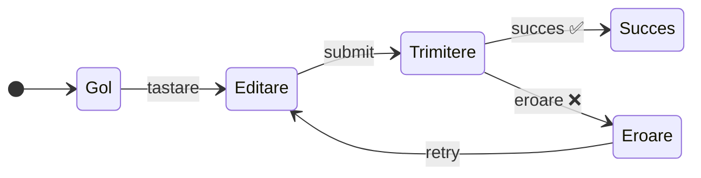

# Gestionarea State-ului
Cum să gândești UI-ul declarativ

<div class="absolute top-2 right-2 w-8 h-8">
<GithubLink repo="https://github.com/cristi-usm/react-course" />
</div>

---
layout: top-title
align: c
color: sky-light
---

:: title ::
# De Ce Contează Gestionarea State-ului?

:: content ::

<div class="text-lg space-y-6 ns-c-tight">

Am văzut cum funcționează `useState` — dar cum **decidem** ce state avem nevoie?

Pe măsură ce componentele devin mai complexe, apare întrebarea:

<div class="grid grid-cols-2 gap-6 mt-6">

<div class="p-6 bg-red-50 dark:bg-red-900/20 rounded-lg border-2 border-red-400">
<div class="font-bold text-xl mb-3">Prea mult state</div>
<div class="text-sm space-y-2">
<div>• Variabile redundante care se contrazic</div>
<div>• Stări "imposibile" (loading + eroare simultan)</div>
<div>• Bug-uri greu de găsit</div>
</div>
</div>

<div class="p-6 bg-green-50 dark:bg-green-900/20 rounded-lg border-2 border-green-400">
<div class="font-bold text-xl mb-3">State bine gândit</div>
<div class="text-sm space-y-2">
<div>• Fiecare variabilă are un rol clar</div>
<div>• Imposibil de ajuns în stări invalide</div>
<div>• UI-ul reflectă mereu corect state-ul</div>
</div>
</div>

</div>

<AdmonitionType type="tip" class="mt-6">

React ne oferă o metodă în **5 pași** pentru a gândi state-ul corect

</AdmonitionType>

</div>

---
layout: section
color: sky-light
---

# Cei 5 Pași ai Gândirii Declarative

Cum structurezi state-ul unui component React

---
layout: top-title
align: c
color: sky-light
---

:: title ::
# Pas 1: Identifică Stările Vizuale

:: content ::

<div class="text-lg space-y-6 ns-c-tight">

Gândește-te la toate **stările posibile** pe care le poate avea UI-ul tău:

<div class="grid grid-cols-5 gap-3 mt-6">

<div class="p-4 bg-gray-50 dark:bg-gray-900/20 rounded-lg border-2 border-gray-400 text-center">
<div class="text-2xl mb-2">📝</div>
<div class="font-bold text-sm">Gol</div>
<div class="text-xs mt-1 opacity-75">Buton dezactivat</div>
</div>

<div class="p-4 bg-blue-50 dark:bg-blue-900/20 rounded-lg border-2 border-blue-400 text-center">
<div class="text-2xl mb-2">⌨️</div>
<div class="font-bold text-sm">Editare</div>
<div class="text-xs mt-1 opacity-75">Buton activat</div>
</div>

<div class="p-4 bg-yellow-50 dark:bg-yellow-900/20 rounded-lg border-2 border-yellow-400 text-center">
<div class="text-2xl mb-2">⏳</div>
<div class="font-bold text-sm">Trimitere</div>
<div class="text-xs mt-1 opacity-75">Formular dezactivat</div>
</div>

<div class="p-4 bg-green-50 dark:bg-green-900/20 rounded-lg border-2 border-green-400 text-center">
<div class="text-2xl mb-2">✅</div>
<div class="font-bold text-sm">Succes</div>
<div class="text-xs mt-1 opacity-75">Mesaj de confirmare</div>
</div>

<div class="p-4 bg-red-50 dark:bg-red-900/20 rounded-lg border-2 border-red-400 text-center">
<div class="text-2xl mb-2">❌</div>
<div class="font-bold text-sm">Eroare</div>
<div class="text-xs mt-1 opacity-75">Mesaj de eroare</div>
</div>

</div>

<AdmonitionType type="tip" class="mt-6">

**Sfat practic:** Creează un "mock" al componentei care primește status-ul ca prop — testezi fiecare stare vizuală înainte de a adăuga logica

</AdmonitionType>

</div>

---
layout: top-title
align: c
color: sky-light
---

:: title ::
# Vizualizarea Stărilor

:: content ::

<div class="text-lg mb-4">
Un component care afișează diferit în funcție de status - modifică prop-ul <code>status</code> pentru a vedea fiecare stare:
</div>

<VisualStatesDemo />

---
layout: top-title
align: c
color: sky-light
---

:: title ::
# Pas 2: Identifică Ce Declanșează Schimbările

:: content ::

<div class="text-lg space-y-6 ns-c-tight">

Fiecare tranziție de state este declanșată de un **input**:

<div class="grid grid-cols-2 gap-6 mt-6">

<div class="p-6 bg-blue-50 dark:bg-blue-900/20 rounded-lg border-2 border-blue-400">
<div class="font-bold text-xl mb-3">Input-uri Umane</div>
<div class="text-sm space-y-2">
<div>• Click pe un buton</div>
<div>• Tastarea într-un câmp</div>
<div>• Navigarea pe un link</div>
<div>• Drag-and-drop</div>
</div>
</div>

<div class="p-6 bg-purple-50 dark:bg-purple-900/20 rounded-lg border-2 border-purple-400">
<div class="font-bold text-xl mb-3">Input-uri de la Computer</div>
<div class="text-sm space-y-2">
<div>• Răspuns de la un API</div>
<div>• Un timeout care expiră</div>
<div>• O imagine care s-a încărcat</div>
<div>• O conexiune WebSocket</div>
</div>
</div>

</div>

<div class="flex justify-center" style="transform: scale(2); transform-origin: center; margin-top: 3rem;">



</div>

</div>

---
layout: top-title
align: c
color: sky-light
---

:: title ::
# Pas 3: Modelează State-ul cu `useState`

:: content ::

<div class="text-lg space-y-6 ns-c-tight">

Începe cu **toate** variabilele de state de care ai nevoie:

```jsx
const [answer, setAnswer] = useState('');
const [isEmpty, setIsEmpty] = useState(true);
const [isTyping, setIsTyping] = useState(false);
const [isSubmitting, setIsSubmitting] = useState(false);
const [error, setError] = useState(null);
const [isSuccess, setIsSuccess] = useState(false);
const [isError, setIsError] = useState(false);
```

<AdmonitionType type="info">

Nu-ți face griji dacă sunt **prea multe** variabile — le vom reduce în pasul următor!

</AdmonitionType>

</div>

---
layout: top-title
align: c
color: sky-light
---

:: title ::
# Pas 4: Elimină State-ul Redundant

:: content ::

<div class="text-lg space-y-4 ns-c-tight">

Pune-ți **3 întrebări** pentru fiecare variabilă de state:

<div class="grid grid-cols-3 gap-4 mt-4">

<div class="p-5 bg-blue-50 dark:bg-blue-900/20 rounded-lg border-l-4 border-blue-500">
<div class="font-bold mb-2">Creează un paradox?</div>
<div class="text-sm"><code>isTyping</code> și <code>isSubmitting</code> nu pot fi ambele <code>true</code> → folosește un singur <code>status</code></div>
</div>

<div class="p-5 bg-green-50 dark:bg-green-900/20 rounded-lg border-l-4 border-green-500">
<div class="font-bold mb-2">Există deja altundeva?</div>
<div class="text-sm"><code>isEmpty</code> se poate calcula din <code>answer.length === 0</code> — nu e nevoie de state separat</div>
</div>

<div class="p-5 bg-purple-50 dark:bg-purple-900/20 rounded-lg border-l-4 border-purple-500">
<div class="font-bold mb-2">E inversul altui state?</div>
<div class="text-sm"><code>isError</code> e echivalent cu <code>error !== null</code> — redundant!</div>
</div>

</div>

**Rezultat: De la 7 variabile la doar 3:**

```jsx
const [answer, setAnswer] = useState('');       // ce a scris utilizatorul
const [error, setError] = useState(null);       // eroarea (dacă există)
const [status, setStatus] = useState('typing'); // 'typing' | 'submitting' | 'success'
```

</div>

---
layout: top-title
align: c
color: sky-light
---

:: title ::
# Pas 5: Conectează Event Handler-ele

:: content ::

<div class="text-lg space-y-4 ns-c-tight">

Ultimul pas — conectează **fiecare interacțiune** la o actualizare de state:

```jsx
async function handleSubmit(e) {
  e.preventDefault();
  setStatus('submitting');
  try {
    await sendAnswer(answer);
    setStatus('success');
  } catch (err) {
    setStatus('typing');
    setError(err);
  }
}

function handleTextChange(e) {
  setAnswer(e.target.value);
}
```

<AdmonitionType type="tip" class="mt-2">

Observă: nu manipulăm DOM-ul direct — doar **actualizăm state-ul**, iar React se ocupă de restul!

</AdmonitionType>

</div>

---
layout: top-title
align: c
color: sky-light
---

:: title ::
# Exemplu Complet: Formular de Feedback

:: content ::

<FeedbackFormDemo />

---
layout: section
color: sky-light
---

# Principiile Structurării State-ului

5 reguli pentru un state curat și fără bug-uri

---
layout: top-title
align: c
color: sky-light
---

:: title ::
# Principiul 1: Grupează State-ul Înrudit

:: content ::

<div class="text-lg space-y-4 ns-c-tight">

Când două variabile se actualizează **mereu împreună**, unește-le într-un singur state:

<div class="grid grid-cols-2 gap-6 mt-4">

<div class="p-5 bg-red-50 dark:bg-red-900/20 rounded-lg border-2 border-red-400">
<div class="font-bold mb-2">❌ Separat</div>

```jsx
const [x, setX] = useState(0);
const [y, setY] = useState(0);
// Risc: uiți să actualizezi pe amândouă
```

</div>

<div class="p-5 bg-green-50 dark:bg-green-900/20 rounded-lg border-2 border-green-400">
<div class="font-bold mb-2">✅ Grupat</div>

```jsx
const [position, setPosition] = useState(
  { x: 0, y: 0 }
);
// O singură actualizare, mereu sincronizate
```

</div>

</div>

<AdmonitionType type="warning" class="mt-4">

Când actualizezi un obiect, trebuie să copii **toate** câmpurile: `setPosition({ ...position, x: 100 })`

</AdmonitionType>

</div>

---
layout: top-title
align: c
color: sky-light
---

:: title ::
# State Grupat - Demo

:: content ::

<div class="text-lg mb-4">
Mișcă cursorul peste zona de preview — coordonatele se actualizează împreună:
</div>

<GroupStateDemo />

---
layout: top-title
align: c
color: sky-light
---

:: title ::
# Principiul 2: Evită Contradicțiile (Stări Imposibile)

:: content ::

<div class="text-lg space-y-4 ns-c-tight">

Nu folosi mai multe flag-uri boolean care pot ajunge în combinații **imposibile**:

<div class="grid grid-cols-2 gap-6 mt-4">

<div class="p-5 bg-red-50 dark:bg-red-900/20 rounded-lg border-2 border-red-400">
<div class="font-bold mb-2">❌ Boolean-uri separate</div>

```jsx
const [isSending, setIsSending] = useState(false);
const [isSent, setIsSent] = useState(false);
// Bug: ce înseamnă isSending=true + isSent=true?
```

</div>

<div class="p-5 bg-green-50 dark:bg-green-900/20 rounded-lg border-2 border-green-400">
<div class="font-bold mb-2">✅ Un singur status</div>

```jsx
const [status, setStatus] = useState('typing');
// 'typing' | 'sending' | 'sent'
const isSending = status === 'sending';
const isSent = status === 'sent';
```

</div>

</div>

<AdmonitionType type="tip" class="mt-4">

**Regula de bază:** Dacă două variabile de state nu ar trebui să fie `true` simultan, înlocuiește-le cu un singur `status`

</AdmonitionType>

</div>

---
layout: top-title
align: c
color: sky-light
---

:: title ::
# Principiul 3: Evită State-ul Redundant

:: content ::

<div class="text-lg space-y-4 ns-c-tight">

Dacă poți **calcula** o valoare din props sau alt state, **nu o stoca** ca state separat:

<div class="grid grid-cols-2 gap-6 mt-4">

<div class="p-5 bg-red-50 dark:bg-red-900/20 rounded-lg border-2 border-red-400">
<div class="font-bold mb-2">❌ Redundant</div>

```jsx
const [firstName, setFirstName] = useState('');
const [lastName, setLastName] = useState('');
const [fullName, setFullName] = useState('');
// fullName trebuie sincronizat manual!
```

</div>

<div class="p-5 bg-green-50 dark:bg-green-900/20 rounded-lg border-2 border-green-400">
<div class="font-bold mb-2">✅ Calculat la render</div>

```jsx
const [firstName, setFirstName] = useState('');
const [lastName, setLastName] = useState('');
// Se calculează automat la fiecare render
const fullName = firstName + ' ' + lastName;
```

</div>

</div>

</div>

---
layout: top-title
align: c
color: sky-light
---

:: title ::
# State Redundant - Demo

:: content ::

<div class="text-lg mb-4">
Compară cele două variante — observă cum versiunea cu state redundant poate deveni desincronizată:
</div>

<RedundantStateDemo />

---
layout: top-title
align: c
color: sky-light
---

:: title ::
# Principiul 4: Evită Duplicarea în State

:: content ::

<div class="text-lg space-y-4 ns-c-tight">

Când ai o **listă** și un element **selectat**, nu stoca obiectul selectat — stochează doar **ID-ul**:

<div class="grid grid-cols-2 gap-6 mt-4">

<div class="p-5 bg-red-50 dark:bg-red-900/20 rounded-lg border-2 border-red-400">
<div class="font-bold mb-2">❌ Obiect duplicat</div>

```jsx
const [items, setItems] = useState(list);
const [selected, setSelected] = useState(list[0]);
// Dacă editezi un item, selected rămâne vechi!
```

</div>

<div class="p-5 bg-green-50 dark:bg-green-900/20 rounded-lg border-2 border-green-400">
<div class="font-bold mb-2">✅ Doar ID-ul</div>

```jsx
const [items, setItems] = useState(list);
const [selectedId, setSelectedId] = useState(0);
// Derivat: mereu sincronizat cu lista
const selected = items.find(i => i.id === selectedId);
```

</div>

</div>

</div>

---
layout: top-title
align: c
color: sky-light
---

:: title ::
# Duplicare în State - Demo

:: content ::

<div class="text-lg mb-4">
Editează titlul unui item selectat — observă diferența între cele două abordări:
</div>

<DuplicationDemo />

---
layout: top-title
align: c
color: sky-light
---

:: title ::
# Principiul 5: Evită State-ul Imbricat

:: content ::

<div class="text-lg space-y-4 ns-c-tight">

Structurile **profund imbricate** sunt greu de actualizat. Preferă structuri **plate** (normalizate):

<div class="grid grid-cols-2 gap-6 mt-4">

<div class="p-5 bg-red-50 dark:bg-red-900/20 rounded-lg border-2 border-red-400">
<div class="font-bold mb-2">❌ Imbricat</div>

```jsx
const [plan, setPlan] = useState({
  title: 'Europa',
  children: [{
    title: 'România',
    children: [{ title: 'București' }]
  }]
});
// Ștergerea necesită copiere la fiecare nivel!
```

</div>

<div class="p-5 bg-green-50 dark:bg-green-900/20 rounded-lg border-2 border-green-400">
<div class="font-bold mb-2">✅ Plat (normalizat)</div>

```jsx
const [places, setPlaces] = useState({
  0: { title: 'Europa', childIds: [1] },
  1: { title: 'România', childIds: [2] },
  2: { title: 'București', childIds: [] }
});
// Ștergerea e simplă: filtrăm childIds
```

</div>

</div>

<AdmonitionType type="tip" class="mt-4">

**Normalizarea** este aceeași idee ca în bazele de date relaționale — stochezi referințe (ID-uri), nu copii ale obiectelor

</AdmonitionType>

</div>

---
layout: top-title
align: c
color: sky-light
---

:: title ::
# Rezumat: Cele 5 Principii

:: content ::

<div class="grid grid-cols-3 gap-4 mt-2">

<div class="p-5 bg-blue-50 dark:bg-blue-900/20 rounded-xl border-l-4 border-blue-500">
<div class="font-bold text-base mb-2">1. Grupează state-ul asociat</div>
<div class="text-sm">State-uri care se actualizează mereu împreună → un singur obiect</div>
</div>

<div class="p-5 bg-red-50 dark:bg-red-900/20 rounded-xl border-l-4 border-red-500">
<div class="font-bold text-base mb-2">2. Fără contradicții</div>
<div class="text-sm">Boolean-uri conflictuale → un singur <code>status</code> string</div>
</div>

<div class="p-5 bg-green-50 dark:bg-green-900/20 rounded-xl border-l-4 border-green-500">
<div class="font-bold text-base mb-2">3. Fără redundanță</div>
<div class="text-sm">Valori calculabile → derivează-le la render, nu ca state separat</div>
</div>

</div>

<div class="flex justify-center gap-4 mt-4">

<div class="p-5 bg-purple-50 dark:bg-purple-900/20 rounded-xl border-l-4 border-purple-500 w-1/3">
<div class="font-bold text-base mb-2">4. Fără duplicare</div>
<div class="text-sm">Obiecte selectate → stochează ID, derivă cu <code>.find()</code></div>
</div>

<div class="p-5 bg-orange-50 dark:bg-orange-900/20 rounded-xl border-l-4 border-orange-500 w-1/3">
<div class="font-bold text-base mb-2">5. Fără imbricare</div>
<div class="text-sm">Structuri adânci → normalizare cu ID-uri și referințe</div>
</div>

</div>

<AdmonitionType type="info" class="mt-4">

**Scopul:** Fă state-ul **cât mai simplu posibil** — fiecare variabilă trebuie să existe dintr-un motiv clar

</AdmonitionType>

---
layout: section
color: sky-light
---

# Partajarea State-ului Între Componente

Cum faci două componente să "știe" una de alta

---
layout: top-title
align: c
color: sky-light
---

:: title ::
# Problema: State Izolat

:: content ::

<div class="text-lg space-y-6 ns-c-tight">

Fiecare componentă are **propriul state**, independent de celelalte.

Dar ce faci când două componente trebuie să se **schimbe împreună**?

```jsx
// Fiecare Panel are propriul isActive — nu se "cunosc"
function Panel({ title, children }) {
  const [isActive, setIsActive] = useState(false);
  return (
    <section>
      <h3>{title}</h3>
      {isActive ? <p>{children}</p> : <button onClick={() => setIsActive(true)}>Arată</button>}
    </section>
  );
}

function App() {
  return (
    <>
      <Panel title="Secțiunea 1">Conținut 1</Panel>
      <Panel title="Secțiunea 2">Conținut 2</Panel>
    </>
  );  // Ambele se pot deschide simultan — nu e un accordion!
}
```

</div>

---
layout: top-title
align: c
color: sky-light
---

:: title ::
# State Izolat - Demo

:: content ::

<IsolatedStateDemo />

---
layout: top-title
align: c
color: sky-light
---

:: title ::
# Soluția: Lifting State Up

:: content ::

<div class="text-lg space-y-6 ns-c-tight">

**"Ridicarea state-ului"** = muți state-ul din componenta copil în **părintele comun**:

<div class="grid grid-cols-3 gap-4 mt-4">

<div class="p-5 bg-blue-50 dark:bg-blue-900/20 rounded-lg border-l-4 border-blue-500">
<div class="font-bold mb-2">Pas 1</div>
<div class="text-sm">

**Elimină** state-ul din componenta copil

</div>
<div class="text-xs mt-2 opacity-75"><code>isActive</code> devine un prop, nu un state</div>
</div>

<div class="p-5 bg-green-50 dark:bg-green-900/20 rounded-lg border-l-4 border-green-500">
<div class="font-bold mb-2">Pas 2</div>
<div class="text-sm">

**Adaugă** state-ul în componentul părinte

</div>
<div class="text-xs mt-2 opacity-75"><code>activeIndex</code> controlat de părinte</div>
</div>

<div class="p-5 bg-purple-50 dark:bg-purple-900/20 rounded-lg border-l-4 border-purple-500">
<div class="font-bold mb-2">Pas 3</div>
<div class="text-sm">

**Transmite** date + event handler-e prin props

</div>
<div class="text-xs mt-2 opacity-75"><code>isActive</code> + <code>onShow</code> ca props</div>
</div>

</div>

<AdmonitionType type="tip" class="mt-4">

**Single source of truth** — pentru fiecare piesă de state, alege **un singur** component care o deține

</AdmonitionType>

</div>

---
color: sky-light
---

```jsx
function Accordion() {
  // State-ul e AICI — părintele controlează cine e activ
  const [activeIndex, setActiveIndex] = useState(0);
  return (
    <>
      <Panel
        title="Despre"
        isActive={activeIndex === 0}        {/* date ↓ */}
        onShow={() => setActiveIndex(0)}    {/* handler ↓ */}
      >Conținut 1</Panel>
      <Panel
        title="Etimologie"
        isActive={activeIndex === 1}
        onShow={() => setActiveIndex(1)}
      >Conținut 2</Panel>
    </>
  );
}

// Panel nu mai are useState — e "controlat" de părinte
function Panel({ title, children, isActive, onShow }) {
  return (
    <section>
      <h3>{title}</h3>
      {isActive ? <p>{children}</p> : <button onClick={onShow}>Arată</button>}
    </section>
  );
}
```

---
layout: top-title
align: c
color: sky-light
---

:: title ::
# Accordion - Demo

:: content ::

<div class="text-lg mb-4">
Doar un singur panel poate fi deschis la un moment dat — state-ul e controlat de părinte:
</div>

<AccordionDemo />

---
layout: top-title
align: c
color: sky-light
---

:: title ::
# Controlled vs. Uncontrolled

:: content ::

<div class="text-lg space-y-6 ns-c-tight">

<div class="grid grid-cols-2 gap-6">

<div class="p-6 bg-gray-50 dark:bg-gray-900/20 rounded-lg border-2 border-gray-400">
<div class="font-bold text-xl mb-3">Uncontrolled</div>
<div class="text-sm space-y-2">
<div>

• Componenta își gestionează **propriul** state
</div>
<div>• Părintele nu poate influența comportamentul</div>
<div>• Mai simplu de folosit, dar mai puțin flexibil</div>
</div>

```jsx
// Panel decide singur dacă e deschis
function Panel() {
  const [isOpen, setIsOpen] = useState(false);
}
```

</div>

<div class="p-6 bg-blue-50 dark:bg-blue-900/20 rounded-lg border-2 border-blue-500">
<div class="font-bold text-xl mb-3">Controlled</div>
<div class="text-sm space-y-2">
<div>

• State-ul vine de la **părinte** prin props
</div>
<div>• Părintele decide comportamentul</div>
<div>• Mai flexibil, poate coordona mai mulți copii</div>
</div>

```jsx
// Părintele decide dacă Panel e deschis
function Panel({ isOpen, onToggle }) {
  // isOpen e prop, nu state local
}
```

</div>

</div>

<AdmonitionType type="info" class="mt-4">

Un `<input>` nativ este **uncontrolled** (browser gestionează valoarea). Un `<input value={text} onChange={...}>` este **controlled** (React gestionează valoarea)

</AdmonitionType>

</div>

---
layout: top-title
align: c
color: sky-light
---

:: title ::
# Controlled vs Uncontrolled - Demo

:: content ::

<div class="text-lg mb-4">
Compară cele două abordări — observă diferența de acces la valoarea input-ului:
</div>

<SyncedInputsDemo />

---
layout: section
color: sky-light
---

# Prezervarea și Resetarea State-ului

Când React păstrează state-ul și când îl distruge

---
layout: top-title
align: c
color: sky-light
---

:: title ::
# State-ul Aparține Poziției, Nu Componentei

:: content ::

<div class="text-lg space-y-6 ns-c-tight">

React asociază state-ul cu **poziția în arborele UI**, nu cu componenta în sine:

```jsx
function App() {
  return (
    <div>
      <Counter />   {/* Poziția 1 → state propriu */}
      <Counter />   {/* Poziția 2 → state complet separat */}
    </div>
  );
}
```

<div class="grid grid-cols-2 gap-6 mt-4">

<div class="p-5 bg-green-50 dark:bg-green-900/20 rounded-lg border-l-4 border-green-500">
<div class="font-bold mb-2">Aceeași componentă, aceeași poziție</div>
<div class="text-sm">State-ul se <strong>păstrează</strong>, chiar dacă props-urile se schimbă</div>
</div>

<div class="p-5 bg-red-50 dark:bg-red-900/20 rounded-lg border-l-4 border-red-500">
<div class="font-bold mb-2">Componentă diferită / poziție diferită</div>
<div class="text-sm">State-ul se <strong>distruge</strong> și se creează de la zero</div>
</div>

</div>

<AdmonitionType type="info" class="mt-4">

**Regula:** Poziția în arbore = primul copil al `<div>`, al doilea copil, etc. — **nu** poziția în codul JSX

</AdmonitionType>

</div>

---
layout: top-title
align: c
color: sky-light
---

:: title ::
# Aceeași Poziție = State Păstrat

:: content ::

<div class="text-lg space-y-4 ns-c-tight">

Când schimbi props-urile dar componenta rămâne **la aceeași poziție**, state-ul se păstrează:

```jsx
function App() {
  const [isFancy, setIsFancy] = useState(false);
  return (
    <div>
      {isFancy ? (
        <Counter isFancy={true} />    // Poziția 0 în <div>
      ) : (
        <Counter isFancy={false} />   // Tot poziția 0 → ACELAȘI state!
      )}
    </div>
  );
}
// Schimbarea checkbox-ului NU resetează contorul
```

<AdmonitionType type="warning">

**Atenție:** Acest comportament poate fi surprinzător! Dacă vrei state **separat** pentru fiecare caz, trebuie să forțezi resetarea

</AdmonitionType>

</div>

---
layout: top-title
align: c
color: sky-light
---

:: title ::
# Aceeași Poziție - Demo

:: content ::

<SamePositionDemo />

---
layout: top-title
align: c
color: sky-light
---

:: title ::
# Componentă Diferită = State Resetat

:: content ::

<div class="text-lg space-y-4 ns-c-tight">

Când la aceeași poziție apare o **componentă diferită**, React distruge tot state-ul:

```jsx
function App() {
  const [isPaused, setIsPaused] = useState(false);
  return (
    <div>
      {isPaused ? (
        <p>La revedere!</p>        // <p> la poziția 0
      ) : (
        <Counter />                // <Counter> la poziția 0
      )}
    </div>
  );
}
// Schimbarea între <p> și <Counter> = state resetat complet
```

<div class="grid grid-cols-3 gap-4 mt-4">

<div class="p-4 bg-green-50 dark:bg-green-900/20 rounded-lg text-center text-sm">
<div class="font-bold mb-1">✅ Păstrat</div>
<code>&lt;Counter&gt;</code> → <code>&lt;Counter&gt;</code>
</div>

<div class="p-4 bg-red-50 dark:bg-red-900/20 rounded-lg text-center text-sm">
<div class="font-bold mb-1">❌ Resetat</div>
<code>&lt;Counter&gt;</code> → <code>&lt;p&gt;</code>
</div>

<div class="p-4 bg-red-50 dark:bg-red-900/20 rounded-lg text-center text-sm">
<div class="font-bold mb-1">❌ Resetat</div>
<code>&lt;div&gt;&lt;Counter/&gt;&lt;/div&gt;</code> → <code>&lt;section&gt;&lt;Counter/&gt;&lt;/section&gt;</code>
</div>

</div>

</div>

---
layout: top-title
align: c
color: sky-light
---

:: title ::
# Prezervarea State-ului - Demo

:: content ::

<div class="text-lg mb-4">
Experimentează — schimbă stilul și observă dacă state-ul se păstrează sau se resetează:
</div>

<PreservedStateDemo />

---
layout: center
color: sky-light
---

<SpeechBubble position="b" color="sky" shape="round" animation="float" textAlign="center" >

# Cum indicăm că două componente de același tip sunt unice?

</SpeechBubble>

---
layout: top-title
align: c
color: sky-light
---

:: title ::
# Forțarea Resetării cu `key`

:: content ::

<div class="text-lg space-y-4 ns-c-tight">

Prop-ul `key` spune explicit lui React: **"aceasta e o instanță diferită"**:

<div class="grid grid-cols-2 gap-6 mt-4">

<div class="p-5 bg-red-50 dark:bg-red-900/20 rounded-lg border-2 border-red-400">
<div class="font-bold mb-2">❌ Fără key — state păstrat</div>

```jsx
// Bug: mesajul lui Ana rămâne când selectezi Bob
{isPlayerA ? (
  <Counter person="Ana" />
) : (
  <Counter person="Bob" />
)}
// Aceeași poziție → state păstrat!
```

</div>

<div class="p-5 bg-green-50 dark:bg-green-900/20 rounded-lg border-2 border-green-400">
<div class="font-bold mb-2">✅ Cu key — state resetat</div>

```jsx
// Corect: fiecare jucător are state propriu
{isPlayerA ? (
  <Counter key="Ana" person="Ana" />
) : (
  <Counter key="Bob" person="Bob" />
)}
// Key diferit → React distruge și recreează
```

</div>

</div>

<AdmonitionType type="tip" class="mt-4">

**Cazul clasic:** Formulare de chat, profile de utilizator, tab-uri — oricând schimbi **ce date** afișezi, folosește `key` pentru a reseta formularul

</AdmonitionType>

</div>

---
layout: top-title
align: c
color: sky-light
---

:: title ::
# Resetare cu `key` - Demo

:: content ::

<div class="text-lg mb-4">
Scrie un mesaj, apoi schimbă contactul — stânga (❌ fără <code>key</code>) păstrează textul, dreapta (✅ cu <code>key</code>) îl resetează:
</div>

<KeyResetDemo />

---
layout: section
color: sky-light
---

# State Derivat

Calculează, nu stoca

---
layout: top-title
align: c
color: sky-light
---

:: title ::
# Ce este State Derivat?

:: content ::

<div class="text-lg space-y-6 ns-c-tight">

**State derivat** = o valoare pe care o **calculezi** din state-ul existent, în loc să o stochezi separat.

<div class="grid grid-cols-2 gap-6 mt-4">

<div class="p-5 bg-red-50 dark:bg-red-900/20 rounded-lg border-2 border-red-400">
<div class="font-bold mb-2">❌ Stocat ca state</div>

```jsx
const [items, setItems] = useState(allItems);
const [query, setQuery] = useState('');
const [filtered, setFiltered] = useState(allItems);

function handleSearch(e) {
  setQuery(e.target.value);
  // Trebuie să sincronizăm manual!
  setFiltered(items.filter(
    i => i.name.includes(e.target.value)
  ));
}
```

</div>

<div class="p-5 bg-green-50 dark:bg-green-900/20 rounded-lg border-2 border-green-400">
<div class="font-bold mb-2">✅ Calculat la render</div>

```jsx
const [items, setItems] = useState(allItems);
const [query, setQuery] = useState('');

// Se recalculează automat la fiecare render
const filtered = items.filter(
  i => i.name.includes(query)
);

function handleSearch(e) {
  setQuery(e.target.value);
  // filtered se actualizează automat!
}
```

</div>

</div>

</div>

---
layout: top-title
align: c
color: sky-light
---

:: title ::
# Când să Derivezi vs. Când să Stochezi

:: content ::

<div class="text-lg space-y-4 ns-c-tight">

Întreabă-te: **pot calcula această valoare din ce am deja?**

<div class="grid grid-cols-2 gap-6 mt-4">

<div class="p-6 bg-blue-50 dark:bg-blue-900/20 rounded-lg border-2 border-blue-400">
<div class="font-bold text-lg mb-3">Derivează (nu stoca)</div>
<div class="text-sm space-y-2">
<div>

• `fullName` din `firstName` + `lastName`
</div>
<div>

• `filteredList` din `items` + `query`
</div>
<div>

• `isEmpty` din `items.length === 0`
</div>
<div>

• `total` din `items.reduce(...)`
</div>
<div>

• `isValid` din validarea câmpurilor
</div>
</div>
</div>

<div class="p-6 bg-purple-50 dark:bg-purple-900/20 rounded-lg border-2 border-purple-400">
<div class="font-bold text-lg mb-3">Stochează ca state</div>
<div class="text-sm space-y-2">
<div>

• Input-ul utilizatorului (`query`, `name`)
</div>
<div>

• Starea UI (`isOpen`, `activeTab`)
</div>
<div>• Date de la server (răspunsuri API)</div>
<div>• Valori care nu pot fi recalculate</div>
<div>• ID-ul elementului selectat</div>
</div>
</div>

</div>

<AdmonitionType type="warning" class="mt-4">

**Anti-pattern comun:** Nu copia props-urile în state! Dacă un prop `color` se schimbă, state-ul `const [c, setC] = useState(color)` **nu se actualizează**

</AdmonitionType>

</div>

---
layout: top-title
align: c
color: sky-light
---

:: title ::
# State Derivat - Demo

:: content ::

<div class="text-lg mb-4">
O listă filtrabilă cu contor — totul derivat din <code>items</code> și <code>query</code>, fără state suplimentar:
</div>

<DerivedStateDemo />

---
layout: section
color: sky-light
---

# Closures și State

Ce sunt closure-urile și cum afectează React

---
layout: top-title
align: c
color: sky-light
---

:: title ::
# Ce este un Closure?

:: content ::

<div class="text-lg space-y-4 ns-c-tight">

Un **closure** este o funcție care **"își amintește"** variabilele din scope-ul în care a fost creată, chiar și după ce acel scope s-a terminat.

```js
function createCounter() {
  let count = 0;                    // variabilă locală

  return function increment() {     // closure — "captează" count
    count++;
    console.log(count);
  };
}

const counter = createCounter();    // createCounter s-a terminat...
counter(); // 1  — dar count încă există!
counter(); // 2  — funcția "își amintește" valoarea
```

<AdmonitionType type="info">

**Regula:** O funcție are mereu acces la variabilele din scope-ul în care a fost **definită**, nu unde este **apelată**

</AdmonitionType>

</div>

---
layout: top-title
align: c
color: sky-light
---

:: title ::
# Closures - Demo

:: content ::

<ClosureDemo />

---
layout: top-title
align: c
color: sky-light
---

:: title ::
# Closures în React

:: content ::

<div class="text-lg space-y-4 ns-c-tight">

În React, **fiecare render creează un nou closure**. Funcțiile din component captează valorile state-ului din acel render:

```jsx
function Counter() {
  const [count, setCount] = useState(0);

  function handleClick() {
    // Această funcție "captează" valoarea lui count
    // din renderul în care a fost creată
    console.log('Count la momentul creării:', count);
  }

  return <button onClick={handleClick}>Count: {count}</button>;
}
```

<div class="grid grid-cols-3 gap-3 mt-4">

<div class="p-4 bg-blue-50 dark:bg-blue-900/20 rounded-lg text-center text-sm">
<div class="font-bold mb-1">Render 1</div>
<code>count = 0</code><br/>
<code>handleClick</code> vede <code>0</code>
</div>

<div class="p-4 bg-blue-50 dark:bg-blue-900/20 rounded-lg text-center text-sm">
<div class="font-bold mb-1">Render 2</div>
<code>count = 1</code><br/>
<code>handleClick</code> vede <code>1</code>
</div>

<div class="p-4 bg-blue-50 dark:bg-blue-900/20 rounded-lg text-center text-sm">
<div class="font-bold mb-1">Render 3</div>
<code>count = 2</code><br/>
<code>handleClick</code> vede <code>2</code>
</div>

</div>

De obicei funcționează perfect. Dar ce se întâmplă cu funcțiile **asincrone**?

</div>

---
layout: top-title
align: c
color: sky-light
---

:: title ::
# Ce este un Stale Closure?

:: content ::

<div class="text-lg space-y-4 ns-c-tight">

Un **stale closure** apare când o funcție asincronă "captează" o valoare **veche** a state-ului:

```jsx
function Counter() {
  const [count, setCount] = useState(0);

  function handleClick() {
    // ⚠️ count este "capturat" la valoarea din momentul creării funcției
    setTimeout(() => {
      alert('Count este: ' + count); // Va afișa valoarea VECHE!
    }, 3000);
  }

  return <button onClick={handleClick}>Count: {count}</button>;
}
```

<AdmonitionType type="warning">

**Scenariul:** Apeși butonul (count=0), apoi apeși rapid de 5 ori. După 3 secunde, alert-ul arată `0`, nu `5`!

</AdmonitionType>

De ce? Fiecare render creează o nouă funcție `handleClick` cu **propria copie** a lui `count` — e ca un screenshot al valorii din acel moment.

</div>

---
layout: top-title
align: c
color: sky-light
---

:: title ::
# Stale Closure - Demo

:: content ::

<div class="text-lg mb-4">
Testează singur — apasă "Arată count", apoi incrementează rapid și așteaptă alert-ul:
</div>

<StaleClosureIntroDemo />

---
layout: top-title
align: c
color: sky-light
---

:: title ::
# Stale Closure cu `setTimeout`

:: content ::

<div class="text-lg space-y-4 ns-c-tight">

<div class="grid grid-cols-2 gap-6">

<div class="p-5 bg-red-50 dark:bg-red-900/20 rounded-lg border-2 border-red-400">
<div class="font-bold mb-2">❌ Valoare veche (stale)</div>

```jsx
function handleClick() {
  setTimeout(() => {
    // count e "capturat" — valoare veche!
    setCount(count + 1);
  }, 1000);
}
// Dacă apeși de 3 ori rapid:
// count: 0 → 0+1=1, 0+1=1, 0+1=1
// Rezultat: 1 (nu 3!)
```

</div>

<div class="p-5 bg-green-50 dark:bg-green-900/20 rounded-lg border-2 border-green-400">
<div class="font-bold mb-2">✅ Updater function (mereu actual)</div>

```jsx
function handleClick() {
  setTimeout(() => {
    // prev e mereu valoarea curentă!
    setCount(prev => prev + 1);
  }, 1000);
}
// Dacă apeși de 3 ori rapid:
// count: 0 → 0+1=1, 1+1=2, 2+1=3
// Rezultat: 3 (corect!)
```

</div>

</div>

<AdmonitionType type="tip" class="mt-4">

**Regula:** Când noul state depinde de cel anterior, folosește **mereu** forma funcțională: `setState(prev => ...)`

</AdmonitionType>

</div>

---
layout: top-title
align: c
color: sky-light
---

:: title ::
# Stale Closure cu `setInterval`

:: content ::

<div class="text-lg space-y-4 ns-c-tight">

Cel mai comun caz de stale closure — un interval care "vede" mereu prima valoare:

```jsx
function Timer() {
  const [seconds, setSeconds] = useState(0);

  function startTimer() {
    setInterval(() => {
      // ❌ seconds este mereu 0 — captat la crearea intervalului!
      setSeconds(seconds + 1); // 0+1=1, 0+1=1, 0+1=1...
    }, 1000);
  }
  // ...
}

//Soluția:
setInterval(() => {
  // ✅ prev este mereu valoarea actuală
  setSeconds(prev => prev + 1); // 0+1=1, 1+1=2, 2+1=3...
}, 1000);
```

<AdmonitionType type="info">

Alte soluții avansate: `useRef` pentru a stoca valoarea curentă, sau `useEffect` cu array de dependențe — le vom vedea în lecțiile despre alte hook-uri

</AdmonitionType>

</div>

---
layout: top-title
align: c
color: sky-light
---

:: title ::
# Stale Closures - Demo

:: content ::

<div class="text-lg mb-4">
Compară cele două variante — apasă rapid de mai multe ori și observă diferența:
</div>

<StaleClosureDemo />

---
layout: top-title
align: c
color: sky-light
---

:: title ::
# Anti-pattern: Props Copiate în State

:: content ::

<div class="text-lg space-y-4 ns-c-tight">

Cea mai comună greșeală a începătorilor — copierea unui prop în `useState`:

<div class="grid grid-cols-2 gap-6 mt-4">

<div class="p-5 bg-red-50 dark:bg-red-900/20 rounded-lg border-2 border-red-400">
<div class="font-bold mb-2">❌ Prop copiat în state</div>

```jsx
function Greeting({ name }) {
  // Bug: dacă părintele schimbă name,
  // state-ul NU se actualizează!
  const [localName, setLocalName] = useState(name);

  return <h1>Salut, {localName}!</h1>;
}
// useState(name) citește name DOAR la mount
```

</div>

<div class="p-5 bg-green-50 dark:bg-green-900/20 rounded-lg border-2 border-green-400">
<div class="font-bold mb-2">✅ Folosește prop-ul direct</div>

```jsx
function Greeting({ name }) {
  // Simplu și mereu corect!
  return <h1>Salut, {name}!</h1>;
}

// Sau derivă din prop:
function Greeting({ name }) {
  const upper = name.toUpperCase();
  return <h1>Salut, {upper}!</h1>;
}
```

</div>

</div>

<AdmonitionType type="warning" class="mt-4">

**Singura excepție:** Când vrei explicit să **ignori** actualizările — numește prop-ul `initialColor`, nu `color`, pentru a semnala intenția

</AdmonitionType>

</div>

---
layout: top-title
align: c
color: sky-light
---

:: title ::
# Props în State - Demo

:: content ::

<div class="text-lg mb-4">
Schimbă culoarea din părinte — observă cum versiunea cu state copiat rămâne desincronizată:
</div>

<PropsInStateDemo />

---
layout: top-title
align: c
color: sky-light
---

:: title ::
# Colocarea State-ului

:: content ::

<div class="text-lg space-y-4 ns-c-tight">

Inversul lui "Lifting State Up" — **coboară state-ul** cât mai aproape de unde e folosit:

<div class="grid grid-cols-2 gap-6 mt-4">

<div class="p-5 bg-red-50 dark:bg-red-900/20 rounded-lg border-2 border-red-400">
<div class="font-bold mb-2">❌ State prea sus</div>

```jsx
function App() {
  // isHovered e aici, dar doar Tooltip îl folosește
  const [isHovered, setIsHovered] = useState(false);

  return (
    <div>
      <Header />        {/* re-render inutil! */}
      <Sidebar />       {/* re-render inutil! */}
      <Tooltip hovered={isHovered}
        onHover={setIsHovered} />
    </div>
  );
}
```

</div>

<div class="p-5 bg-green-50 dark:bg-green-900/20 rounded-lg border-2 border-green-400">
<div class="font-bold mb-2">✅ State colocat</div>

```jsx
function App() {
  return (
    <div>
      <Header />        {/* nu se re-renderizează */}
      <Sidebar />       {/* nu se re-renderizează */}
      <Tooltip />       {/* state-ul e AICI */}
    </div>
  );
}

function Tooltip() {
  const [isHovered, setIsHovered] = useState(false);
  // Doar Tooltip se re-renderizează!
}
```

</div>

</div>

</div>

---
layout: top-title
align: c
color: sky-light
---

:: title ::
# Când Ridici vs. Când Cobori State-ul

:: content ::

<div class="text-lg space-y-6 ns-c-tight">

<div class="grid grid-cols-2 gap-6">

<div class="p-6 bg-blue-50 dark:bg-blue-900/20 rounded-lg border-l-4 border-blue-500">
<div class="font-bold text-lg mb-3">Ridică (Lift Up)</div>
<div class="text-sm space-y-2">
<div>

• 2+ componente trebuie să **partajeze** state-ul
</div>
<div>

• Părintele trebuie să **coordoneze** copiii
</div>
<div>

• State-ul influențează **mai multe** zone ale UI-ului
</div>
</div>
<div class="mt-3 text-xs opacity-75">Ex: Accordion, formulare sincronizate, filtre globale</div>
</div>

<div class="p-6 bg-green-50 dark:bg-green-900/20 rounded-lg border-l-4 border-green-500">
<div class="font-bold text-lg mb-3">Coboară (Colocare)</div>
<div class="text-sm space-y-2">
<div>

• State-ul e folosit **doar** de o singură componentă
</div>
<div>

• E state de **UI local** (hover, focus, dropdown)
</div>
<div>• Nicio altă componentă nu are nevoie de el</div>
</div>
<div class="mt-3 text-xs opacity-75">Ex: Tooltip, dropdown, input focus, animații locale</div>
</div>

</div>

<AdmonitionType type="tip" class="mt-6">

**Regula de bază:** Ține state-ul cât mai **jos** posibil în arbore, și ridică-l **doar** când e nevoie de partajare

</AdmonitionType>

</div>

---
layout: top-title
align: c
color: sky-light
---

:: title ::
# Colocare - Demo

:: content ::

<div class="text-lg mb-4">
Compară: state-ul <code>isHovered</code> în părinte (tot re-render) vs. în copil (doar el se actualizează):
</div>

<ColocateDemo />
